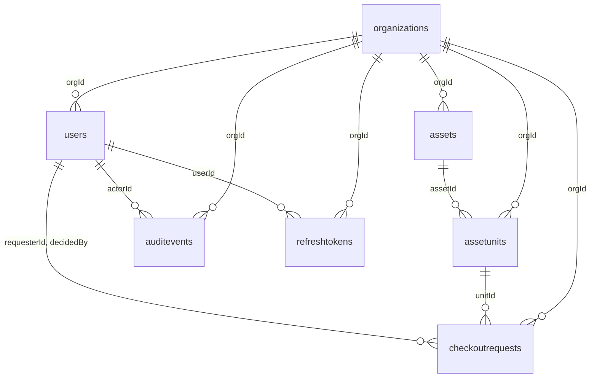

# SafeDrop data model

|                    |                                                                                         |
| :----------------- | :-------------------------------------------------------------------------------------- |
| **Owner**          | Alexa Stein (Team Lead)                                                                 |
| **Change control** | Changed only by pull request. The owner reviews every change to this file.              |
| **Status**         | Canonical. Reflects the models and migrations in `code/backend` at the time of writing. |
| **Refs**           | Kickoff section 2; SDD section 2.4 (data model) and 2.5 (audit)                         |

This is the one canonical description of what is stored in MongoDB. If it is not written here, or it is here
and the code disagrees, that is a bug in one of the two.

## Keeping this file true

The code is what runs, so this file describes it; it does not override it. The sources are:

| What                             | Where                                                                             |
| :------------------------------- | :-------------------------------------------------------------------------------- |
| Schemas, one file per collection | `code/backend/src/models/` (shared rules in `base.js`)                            |
| Every index                      | `code/backend/migrations/` (schemas declare none; `autoIndex` is off)             |
| Enumerated values                | `code/backend/src/utils/constants.js` and `code/backend/src/utils/permissions.js` |
| Checkout state machine           | `code/backend/src/services/checkout.service.js` (`TRANSITIONS`)                   |

**Any pull request that changes a model, a migration or an enumeration must update this file in the same pull
request.** Adding an enumerated value is a design change (the code says so too): update the SDD and this file
together.

## Collections at a glance

Seven collections. All but `organizations` are tenant-owned and carry `orgId`.

| Collection         | Model file           | What a document is                                             | Tenant key                    |
| :----------------- | :------------------- | :------------------------------------------------------------- | :---------------------------- |
| `organizations`    | `Organization.js`    | A tenant: the organisation itself                              | Its own `_id` _is_ the tenant |
| `users`            | `User.js`            | A person in one organisation, with one role                    | `orgId`                       |
| `refreshtokens`    | `RefreshToken.js`    | One issued refresh token in a rotation chain, stored as a hash | `orgId`                       |
| `assets`           | `Asset.js`           | A _kind_ of item the organisation lends ("Dell XPS 15")        | `orgId`                       |
| `assetunits`       | `AssetUnit.js`       | One physical, individually tracked object, tagged              | `orgId`                       |
| `checkoutrequests` | `CheckoutRequest.js` | One member's request to borrow one unit; the workflow document | `orgId`                       |
| `auditevents`      | `AuditEvent.js`      | An append-only record of who did what                          | `orgId`                       |

`auditevents.targetId` points at a document in _any_ collection, chosen by `targetType`, so it is not drawn.

## Cross-cutting conventions

Three conventions apply to every collection. They are set once in `code/backend/src/models/base.js`, and every
model is built through `createSchema()` so they cannot drift.

### 1. The tenant key is `orgId`

Every tenant-owned collection carries an `orgId` field:

- Type `ObjectId`, **required** and **immutable**: a document can never move to another organisation.
- **Set by the server** from the verified access token, never from the request. Client-supplied tenant keys are
  stripped from params, query and body before any handler runs.
- **Every repository function takes `orgId` first** and folds it into its filter, so a document from another
  tenant is simply never matched. A record that belongs to another organisation is reported as **404**, never
  403, which would confirm that the id exists (SR-2).
- **Every tenant index leads with `orgId`** (NFR-4), because every query is scoped by tenant first. The
  exceptions are listed under [Indexes](#indexes-and-migrations).

> **Naming decision: `orgId` is the surviving name.** The kickoff agreed convention (a) as `organizationId` on
> every collection. The merged and tested code uses `orgId` throughout (about 280 references in
> `code/backend/src`, plus the database indexes), so `orgId` is recorded here as the agreed name and the code
> is not renamed. Do not introduce `organizationId`, and do not use `organisationId` or `orgID`: Mongoose runs
> with `strictQuery: 'throw'`, so a filter on a mistyped tenant key throws instead of silently matching every
> organisation.

The `organizations` collection has no `orgId`; its own `_id` is the tenant. Other collections refer to it as
`orgId`.

### 2. Timestamps are `createdAt` and `updatedAt`

Every collection has `createdAt` and `updatedAt`, maintained by Mongoose (`timestamps: true` in
`baseSchemaOptions`). Application code does not set them.

**One documented exception: `auditevents`.** See [Documented exception: AuditEvent](#documented-exception-auditevent).

### 3. Identifiers and serialisation

- In the database every document has an `_id` (`ObjectId`).
- In JSON, `_id` is dropped and an **`id` string** is sent instead. `__v` is not sent, and nested `ObjectId`
  values are flattened to strings.
- `passwordHash` is removed from every JSON output unconditionally, as a backstop. Secret fields are also
  `select: false` on the schema, so a query never returns them unless a repository asks by name:
  `users.passwordHash` and `users.inviteTokenHash`.

### Rules that follow from these

- **Indexes live only in migrations.** Schemas declare none, and `autoIndex` is off, so a process starting up
  never creates an index by itself. Every index is named explicitly so `down()` drops exactly what `up()`
  created.
- **References are plain `ObjectId` fields**, not Mongoose `ref`s, and nothing is populated. Same-tenant
  integrity is kept by the services looking references up through tenant-scoped repository calls.
- **Enumerated values have one source** (`constants.js`, `permissions.js`), used by the Mongoose `enum`s and
  the request validation alike, so a model and its validator cannot disagree.
- **Filters are sanitised**: `sanitizeFilter` is on globally, and a query operator the server builds itself is
  marked trusted explicitly.

## Documented exception: AuditEvent

`auditevents` does **not** follow convention 2. It disables Mongoose timestamps (`timestamps: false`) and has
no `createdAt` or `updatedAt`. It has its own field instead:

| Field       | Type   | Rule                                                                                                                            |
| :---------- | :----- | :------------------------------------------------------------------------------------------------------------------------------ |
| `timestamp` | `Date` | Immutable. **Always set by the server**: re-stamped on every `save()` and `insertMany()`, so a caller cannot backdate an event. |

Why: an audit row is written once and never updated (SR-8), so an `updatedAt` would be meaningless, and the
event's time must be one the server controls and cannot be supplied by the caller. Every index and query on
audit events therefore uses `timestamp`, not `createdAt`.

The collection differs from the rest in two related ways: it uses `strict: 'throw'` (a row carrying a field the
schema does not define is an error, not silently trimmed), and every Mongoose path that could change or remove
a row throws. It still follows conventions 1 and 3.

## Collections

Field tables list what is stored. "Req." is Mongoose `required`. Every collection also has `_id`, `createdAt`
and `updatedAt`, except `auditevents` (no `createdAt`/`updatedAt`; see above). `orgId` is on every collection
except `organizations`.

### organizations

The tenant itself and the root of every tenant boundary. Model: `Organization.js`.

| Field  | Type   | Req. | Rules                                                                                         |
| :----- | :----- | :--: | :-------------------------------------------------------------------------------------------- |
| `name` | String | yes  | Trimmed, 2 to 120 characters                                                                  |
| `slug` | String | yes  | **Immutable**. Trimmed, lowercase, 1 to 64 characters of `a-z0-9-`, alphanumeric at both ends |

The `slug` is the tenant's public handle. Because email is unique per organisation, login takes the slug plus
an email and password, and the slug selects the tenant. It is derived from the name at creation and never
changes, so an established login identifier cannot change under its users.

Note: `updatedAt` is also bumped deliberately by role changes. Writing to this one shared document makes
concurrent role changes conflict, which is what stops two admins from demoting each other at the same instant
and leaving the organisation with no admin.

### users

A person within one organisation. Model: `User.js`.

| Field             | Type     | Req. | Rules                                                                                             |
| :---------------- | :------- | :--: | :------------------------------------------------------------------------------------------------ |
| `orgId`           | ObjectId | yes  | Tenant key (immutable)                                                                            |
| `email`           | String   | yes  | Trimmed, lowercased, at most 254 characters. **Unique per organisation**, not globally            |
| `passwordHash`    | String   | yes  | bcrypt hash. `select: false`; never serialised. See invitation note                               |
| `name`            | String   | yes  | Trimmed, 1 to 120 characters                                                                      |
| `role`            | String   | yes  | `MEMBER`, `APPROVER` or `ORG_ADMIN`. Default `MEMBER`                                             |
| `inviteTokenHash` | String   |  no  | SHA-256 of the invitation token. `select: false`. Present only while an invitation is outstanding |
| `inviteExpiresAt` | Date     |  no  | When the invitation stops working. Present only while an invitation is outstanding                |

- **One organisation, one role.** A user belongs to exactly one organisation and holds exactly one role, which
  is the input to every authorisation decision. Because email is unique per organisation, the same address can
  exist in two tenants.
- **Invitations.** An invited member is created with no usable password: `passwordHash` holds a bcrypt hash of a
  random value that nobody knows, so no one can sign in as them. The invitation link carries a one-time token;
  only its hash is stored. `inviteExpiresAt` being set means the invitation is outstanding (pending until that
  instant, expired after it). Accepting the invitation stores the chosen password's hash and removes both
  invite fields in one atomic update, which is what makes the link single-use. The raw token is never stored.
- **Last admin.** An organisation must keep at least one `ORG_ADMIN`. This is enforced by the service in a
  transaction, not by the schema.

### refreshtokens

One issued refresh token, stored only as a hash. Model: `RefreshToken.js`.

| Field               | Type     | Req. | Rules                                                                                                     |
| :------------------ | :------- | :--: | :-------------------------------------------------------------------------------------------------------- |
| `orgId`             | ObjectId | yes  | Tenant key (immutable)                                                                                    |
| `userId`            | ObjectId | yes  | **Immutable**. The `users` document this token belongs to                                                 |
| `familyId`          | ObjectId | yes  | **Immutable**. Shared by every token descending from one login                                            |
| `tokenHash`         | String   | yes  | **Immutable**. SHA-256 of the opaque value given to the client; the raw value is never stored             |
| `expiresAt`         | Date     | yes  | Idle expiry: moves forward on each rotation, capped by `absoluteExpiresAt`                                |
| `absoluteExpiresAt` | Date     | yes  | **Immutable**. Fixed at login and inherited by every rotation; caps the session's total life. TTL-indexed |
| `lastUsedAt`        | Date     |  no  | Default `null`                                                                                            |
| `revokedAt`         | Date     |  no  | Default `null`                                                                                            |
| `replacedBy`        | ObjectId |  no  | Default `null`. The token that replaced this one when it was rotated                                      |

Each row is one token in a rotation chain: rotation marks the old token's `replacedBy`. Presenting a token that
has already been rotated means two parties hold tokens from one family, so the whole family is revoked. A
virtual `isActive` (not stored) is true only when the token is not revoked, not rotated away, and inside both
expiry windows.

### assets

A _kind_ of item the organisation lends. Model: `Asset.js`.

| Field         | Type     | Req. | Rules                                            |
| :------------ | :------- | :--: | :----------------------------------------------- |
| `orgId`       | ObjectId | yes  | Tenant key (immutable)                           |
| `name`        | String   | yes  | Trimmed, 1 to 120 characters                     |
| `category`    | String   | yes  | Trimmed, 1 to 60 characters                      |
| `description` | String   |  no  | Trimmed, at most 2000 characters. Default `''`   |
| `imageUrl`    | String   |  no  | Trimmed, at most 2048 characters. Default `null` |
| `retiredAt`   | Date     |  no  | Default `null`. Set when the asset is retired    |

An asset is the catalogue entry, not a physical object; the physical objects are `assetunits`. **Retirement is a
soft delete**: `retiredAt` is stamped and the row stays, so historical requests and audit events still resolve
to a real asset.

### assetunits

One physical, individually trackable object. Model: `AssetUnit.js`.

| Field       | Type     | Req. | Rules                                                                          |
| :---------- | :------- | :--: | :----------------------------------------------------------------------------- |
| `orgId`     | ObjectId | yes  | Tenant key (immutable)                                                         |
| `assetId`   | ObjectId | yes  | **Immutable**. The `assets` document describing what kind of thing this is     |
| `tag`       | String   | yes  | Barcode or asset tag. Trimmed, 1 to 64 characters. **Unique per organisation** |
| `serial`    | String   |  no  | Trimmed, at most 128 characters. Default `null`                                |
| `condition` | String   |  no  | `NEW`, `GOOD`, `FAIR` or `POOR`. Default `GOOD`                                |
| `status`    | String   | yes  | `AVAILABLE`, `HELD`, `OUT` or `RETIRED`. Default `AVAILABLE`                   |

`status` is the unit's own lifecycle, moved by the checkout flow: `AVAILABLE`, then `HELD` when a request is
approved, then `OUT` when checked out, then `AVAILABLE` again on return. A unit lost with a request becomes
`RETIRED`. It is distinct from a request's `state`.

### checkoutrequests

One member's request to borrow one unit; the workflow document. Model: `CheckoutRequest.js`.

| Field          | Type     | Req. | Rules                                                        |
| :------------- | :------- | :--: | :----------------------------------------------------------- |
| `orgId`        | ObjectId | yes  | Tenant key (immutable)                                       |
| `unitId`       | ObjectId | yes  | **Immutable**. The `assetunits` document being requested     |
| `requesterId`  | ObjectId | yes  | **Immutable**. The `users` document making the request       |
| `state`        | String   | yes  | One of the eight states below. Default `PENDING`             |
| `neededFrom`   | Date     | yes  | Start of the period the requester needs the unit             |
| `neededTo`     | Date     | yes  | End of that period                                           |
| `note`         | String   |  no  | Trimmed, at most 1000 characters. Default `''`               |
| `decidedBy`    | ObjectId |  no  | Default `null`. The `users` document that approved or denied |
| `decidedAt`    | Date     |  no  | Default `null`                                               |
| `decisionNote` | String   |  no  | Trimmed, at most 1000 characters. Default `''`               |
| `checkedOutAt` | Date     |  no  | Default `null`                                               |
| `dueAt`        | Date     |  no  | Default `null`                                               |
| `returnedAt`   | Date     |  no  | Default `null`                                               |

`unitId` and `requesterId` are immutable so a request cannot be retargeted at another unit or person after the
fact; the audit trail would no longer describe what was approved. The nullable fields are filled in as the
request advances. Which of them must be set is decided by the transition rules in the service, not by the
schema.

**State machine** (`TRANSITIONS` in `checkout.service.js` is the authority). Any move not listed is refused:

| From          | To            | Effect on the unit's `status` |
| :------------ | :------------ | :---------------------------- |
| `PENDING`     | `APPROVED`    | `HELD`                        |
| `PENDING`     | `DENIED`      | none                          |
| `PENDING`     | `CANCELLED`   | none                          |
| `APPROVED`    | `CANCELLED`   | `AVAILABLE`                   |
| `APPROVED`    | `CHECKED_OUT` | `OUT`                         |
| `CHECKED_OUT` | `RETURNED`    | `AVAILABLE`                   |
| `CHECKED_OUT` | `OVERDUE`     | none                          |
| `CHECKED_OUT` | `LOST`        | `RETIRED`                     |
| `OVERDUE`     | `RETURNED`    | `AVAILABLE`                   |
| `OVERDUE`     | `LOST`        | `RETIRED`                     |

Terminal states, with no outgoing moves: `DENIED`, `CANCELLED`, `RETURNED`, `LOST`. The moves to `OVERDUE` and
`LOST` are defined in the table but are planned for Iteration 2 (a scheduler sets `OVERDUE`).

### auditevents

The append-only record of who did what (SR-8, SR-9, SR-10). Model: `AuditEvent.js`. Note the
[documented exception](#documented-exception-auditevent): it has `timestamp` instead of
`createdAt`/`updatedAt`.

| Field        | Type     | Req. | Rules                                                                                   |
| :----------- | :------- | :--: | :-------------------------------------------------------------------------------------- |
| `orgId`      | ObjectId | yes  | Tenant key (immutable)                                                                  |
| `actorId`    | ObjectId | yes  | **Immutable**. The `users` document that acted                                          |
| `actorRole`  | String   | yes  | **Immutable**. The actor's role _at the time_, so a later role change cannot rewrite it |
| `action`     | String   | yes  | **Immutable**. One of the audit actions below                                           |
| `targetType` | String   | yes  | **Immutable**. Which collection `targetId` points into (below)                          |
| `targetId`   | ObjectId | yes  | **Immutable**. The affected document; its collection is given by `targetType`           |
| `before`     | Mixed    |  no  | **Immutable**. State before the change, or `null` for a creation. Default `null`        |
| `after`      | Mixed    |  no  | **Immutable**. State after the change. Default `null`                                   |
| `timestamp`  | Date     |  no  | **Immutable**, server-set. Defaults to now, and is re-stamped on every insert           |
| `requestId`  | String   |  no  | **Immutable**. Correlates the event with the request's log lines. Default `null`        |

Every field is immutable, and every Mongoose path that could update or remove a row (updates, deletes,
`bulkWrite`, and aggregations with `$out` or `$merge`) throws `AuditImmutabilityError`. The repository exposes
only "append" and "query". An audit event is written in the **same transaction** as the change it describes, so
the two commit together or not at all. **Events must never contain a credential**: no password, hash, or
invitation token appears in `before` or `after`.

## Enumerations

| Enumeration       | Values                                                                                                                                                                                                                       | Source                 |
| :---------------- | :--------------------------------------------------------------------------------------------------------------------------------------------------------------------------------------------------------------------------- | :--------------------- |
| Role              | `MEMBER`, `APPROVER`, `ORG_ADMIN` (cumulative: each holds the previous role's permissions)                                                                                                                                   | `utils/permissions.js` |
| Unit status       | `AVAILABLE`, `HELD`, `OUT`, `RETIRED`                                                                                                                                                                                        | `utils/constants.js`   |
| Asset condition   | `NEW`, `GOOD`, `FAIR`, `POOR`                                                                                                                                                                                                | `utils/constants.js`   |
| Request state     | `PENDING`, `APPROVED`, `DENIED`, `CANCELLED`, `CHECKED_OUT`, `OVERDUE`, `RETURNED`, `LOST`                                                                                                                                   | `utils/constants.js`   |
| Audit action      | `REQUEST_SUBMITTED`, `REQUEST_APPROVED`, `REQUEST_DENIED`, `REQUEST_CANCELLED`, `ASSET_CHECKED_OUT`, `ASSET_RETURNED`, `ASSET_CREATED`, `ASSET_UPDATED`, `ASSET_RETIRED`, `USER_ROLE_CHANGED`, `USER_INVITED`, `ORG_CREATED` | `utils/constants.js`   |
| Audit target type | `Organization`, `User`, `Asset`, `AssetUnit`, `CheckoutRequest`                                                                                                                                                              | `utils/constants.js`   |

## Indexes and migrations

Indexes are created only by the migrations in `code/backend/migrations/`, and the test setup applies them to the
in-memory database, so unique constraints and the TTL behave the same under test as in production.

| Collection         | Index                         | Keys                                                        | Notes                                                     |
| :----------------- | :---------------------------- | :---------------------------------------------------------- | :-------------------------------------------------------- |
| `organizations`    | `slug_unique`                 | `slug`                                                      | Unique                                                    |
| `users`            | `orgId_email_unique`          | `orgId`, `email`                                            | **Unique**: email is unique per organisation              |
| `users`            | `orgId_role`                  | `orgId`, `role`                                             |                                                           |
| `users`            | `inviteTokenHash_unique`      | `inviteTokenHash`                                           | **Unique, partial** (only documents where it is a string) |
| `refreshtokens`    | `tokenHash_unique`            | `tokenHash`                                                 | Unique                                                    |
| `refreshtokens`    | `orgId_userId`                | `orgId`, `userId`                                           |                                                           |
| `refreshtokens`    | `orgId_familyId`              | `orgId`, `familyId`                                         |                                                           |
| `refreshtokens`    | `expiresAt`                   | `expiresAt`                                                 |                                                           |
| `refreshtokens`    | `absoluteExpiresAt_ttl`       | `absoluteExpiresAt`                                         | **TTL** (`expireAfterSeconds: 0`); see below              |
| `assets`           | `orgId_name`                  | `orgId`, `name`                                             |                                                           |
| `assets`           | `orgId_category`              | `orgId`, `category`                                         |                                                           |
| `assets`           | `orgId_retiredAt`             | `orgId`, `retiredAt`                                        |                                                           |
| `assetunits`       | `orgId_tag_unique`            | `orgId`, `tag`                                              | **Unique**: a tag is unique within an organisation        |
| `assetunits`       | `orgId_assetId`               | `orgId`, `assetId`                                          |                                                           |
| `assetunits`       | `orgId_status`                | `orgId`, `status`                                           |                                                           |
| `checkoutrequests` | `orgId_state_dueAt`           | `orgId`, `state`, `dueAt`                                   |                                                           |
| `checkoutrequests` | `orgId_requesterId_createdAt` | `orgId`, `requesterId`, `createdAt` (descending)            |                                                           |
| `checkoutrequests` | `orgId_unitId_state`          | `orgId`, `unitId`, `state`                                  |                                                           |
| `auditevents`      | `orgId_timestamp`             | `orgId`, `timestamp` (descending)                           |                                                           |
| `auditevents`      | `orgId_target_timestamp`      | `orgId`, `targetType`, `targetId`, `timestamp` (descending) |                                                           |
| `auditevents`      | `orgId_actorId_timestamp`     | `orgId`, `actorId`, `timestamp` (descending)                |                                                           |

**Indexes that do not lead with `orgId`**, and why:

- `organizations.slug_unique`: on the tenant document itself, which has no `orgId`.
- `refreshtokens.tokenHash_unique` and `users.inviteTokenHash_unique`: the refresh and accept-invitation routes
  are reached before any tenant is verified. The token, 256 bits of randomness, is itself the credential, and
  the tenant is read _from_ the document that the token finds. These are the only two lookups of a
  tenant-owned document made without a tenant. (The third tenant-less lookup, an organisation by `slug` at
  login, finds the tenant itself.)
- `refreshtokens.expiresAt`: a single-field index in the initial migration.

**TTL.** `absoluteExpiresAt_ttl` deletes a refresh token when its _absolute_ expiry passes, not its idle expiry.
A rotated-away token has to stay in the collection for the whole life of its family, because that is what lets
reuse of a stolen ancestor be detected; expiring it on the idle timeout would delete the evidence while the
session was still alive.

Migration files, in order:

1. `20260916000000-initial-indexes.js`: every index above except `users.inviteTokenHash_unique`.
2. `20260919000000-invite-token-index.js`: `users.inviteTokenHash_unique`.

## Changing the model

1. Change the model and, if an index or constraint changes, add a **new migration**. Do not edit a migration
   that has already run.
2. If an enumerated value is added or removed, change it in `constants.js` or `permissions.js` only.
3. Update this file in the same pull request, and ask the owner (top of file) to review it.
4. If a change touches the tenant key, the timestamps, or the serialisation rules, it is a change to a
   cross-cutting convention: say so in the pull request description.
